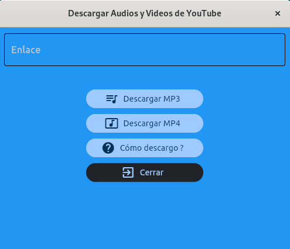

# Descargar mp3 o mp4 de yt

* Objetivo
* Herramientas
* Conclusión

---
## Objetivo
El objetivo de este respositorio es subir mis prácticas, en este caso utilizando cómo lenguaje de programación **Python**.
Después de investigar e ir comparando código, fuí desarrollando de a poco esta app. La misma es con fines educativos, no soy responsable por el uso que se le de a la misma.

## Herramientas
* flet
* pytube
* tkinter

## Conclusión
