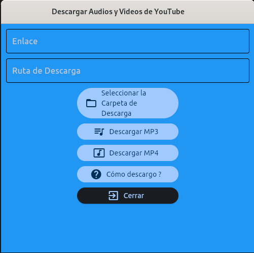

# Descargar mp3 o mp4 de yt

* Objetivo
* Herramientas
* Conclusión
* Instalación

---
## Objetivo
El objetivo de este respositorio es subir mis prácticas, en este caso utilizando cómo lenguaje de programación **Python**.
Después de investigar e ir comparando código, fuí desarrollando de a poco esta app. La misma es con fines educativos, no soy responsable por el uso que se le de a la misma.

## Herramientas
* flet
* yt-dlp

## Instalación
Crear un entorno virtual e instalar los requerimientos:
~~~
$ python3 -m venv .env
$ source .env/bin/activate
$ pip install -r requirements.txt
~~~
Una vez que tenemos todo instalado hay que ejecutar main.py
~~~
$ python3 main.py
~~~

## Conclusión
