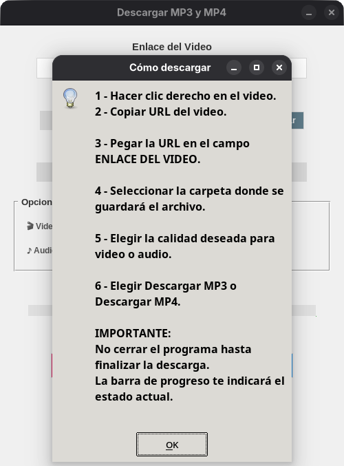

# Descargar mp3 o mp4 de yt

* Objetivo
* Herramientas
* Instalación
* Conclusión

---
## Objetivo
El objetivo de este respositorio es subir mis prácticas, en este caso utilizando cómo lenguaje de programación **Python**.
Después de investigar e ir comparando código, fuí desarrollando de a poco esta app. La misma es con fines educativos, no soy responsable por el uso que se le de a la misma.

## Herramientas
* tkinter
* yt-dlp
* **FFmpeg** (Requerido para unir audio y video en alta calidad)

## Requisito: FFmpeg
Para que la aplicación funcione correctamente (especialmente para descargar videos en alta resolución o convertir a MP3), es **obligatorio** tener instalado FFmpeg en el sistema.

### Instalación en Linux
Si no lo tienes instalado, puedes hacerlo siguiendo estos pasos según tu distribución:

**Ubuntu / Debian / Linux Mint / Kali:**
~~~bash
$ sudo apt update
$ sudo apt install ffmpeg
~~~

**Fedora:**
~~~bash
$ sudo dnf install ffmpeg
~~~

**Arch Linux / Manjaro:**
~~~bash
$ sudo pacman -S ffmpeg
~~~

**Verificación:**
Para comprobar si se instaló correctamente, ejecuta:
~~~bash
$ ffmpeg -version
~~~

## Instalación de la App
Crear un entorno virtual e instalar los requerimientos:
~~~
$ python3 -m venv .env
$ source .env/bin/activate
$ pip install -r requirements.txt
~~~
Una vez que tenemos todo instalado hay que ejecutar main.py
~~~
$ python3 main.py
~~~

## Conclusión
